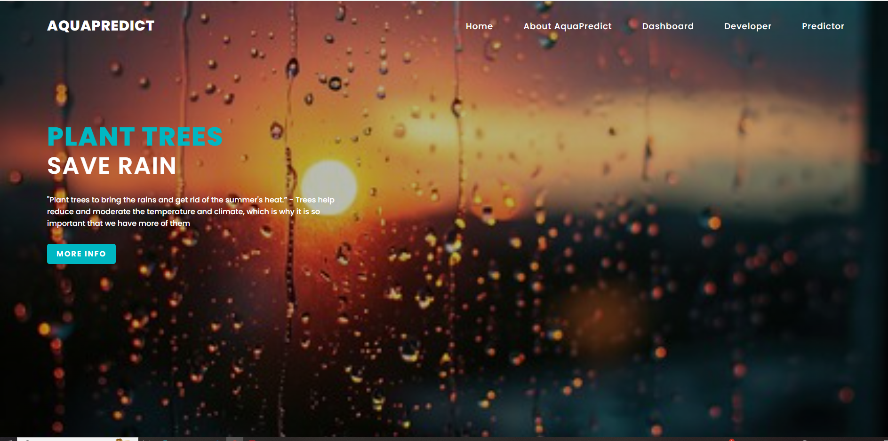

# Rain-Prediction

[](https://aqua-predict.onrender.com)
**Live Application:** [https://aqua-predict.onrender.com](https://aqua-predict.onrender.com)

India is an agricultural country and its economy is largely based upon
crop productivity and rainfall. For analyzing the crop productivity,
rainfall prediction is required and necessary to all farmers. Rainfall
Prediction is the application of science and technology to predict the state
of the atmosphere. It is important to exactly determine the rainfall for
effective use of water resources, crop productivity and pre planning of
water structures. Using different data mining techniques it can predict
rainfall. Data mining techniques are used to estimate the rainfall
numerically. This paper focuses some of the popular data mining
algorithms for rainfall prediction. SVM, Random forest, Decision Tree,
Neural Network and fuzzy logic are some of the algorithms compared in
this paper. From that comparison, it can analyze which method gives
better accuracy for rainfall prediction.

# Tech Stack
* Front-End: HTML, CSS, Bootstrap
* Back-End: Flask
* IDE: Jupyter notebook, Pycharm

# How to Run

See the detailed setup instructions below. For API integration, refer to [API_DOCUMENTATION.md](API_DOCUMENTATION.md).


## Prerequisites
- **Python 3.10 or higher** (recommended: Python 3.10, 3.11, or 3.12)
- pip (Python package manager)

## Setup Instructions

### 1. Clone the Repository
```bash
git clone <repository-url>
cd Project
```

### 2. Create Virtual Environment
```bash
# Create virtual environment
python -m venv venv

# Activate virtual environment
# On Windows:
venv\Scripts\activate
# On macOS/Linux:
source venv/bin/activate
```

### 3. Install Dependencies
```bash
pip install --upgrade pip
pip install -r requirements.txt
```

### 4. Configure Environment Variables
```bash
# Copy the example environment file
copy .env.example .env    # Windows
# cp .env.example .env    # macOS/Linux

# Edit .env and set your SECRET_KEY
# Use a secure random key for production!
```

### 5. Run the Application
```bash
python app.py
```

The application will be available at `http://localhost:5000`

## Troubleshooting

### Model Loading Issues
If you encounter model loading errors, you may need to retrain the models with the updated libraries:
1. Navigate to `testing_notebooks/`
2. Run the training notebooks to regenerate model files
3. Ensure the `.pkl` files are saved in the `models/` directory

### Dependency Conflicts
If you face package conflicts:
```bash
pip install --upgrade --force-reinstall -r requirements.txt
```

# Screenshots

## Dashboard


## Static Assets
The project includes various visualization screenshots located in the `static/` directory:
- Dashboard visualizations (1.png through 9.png)
- Developer photo (dev.jpg)
- Weather result images (rainy.jpg, sunny.jpg, sunny.png)
  
# Workflow

# Data Collection: 
Any dataset can be used to train this module
We've used the popular kaggle dataset
[Rainfall Prediction in Australia dataset](https://www.kaggle.com/jsphyg/weather-dataset-rattle-package) from Kaggle

# Model Creation:
* Different types of models were tried like catboost, random forest, logistic regression, xgboost, support vector machines, knn, naive bayes.
* Out of these catboost, random forest and support vector machines were top 3
* The conclusion were made using classification metrics. roc curve and auc score
# Model Deployment
* The model is deployed using Flask api


