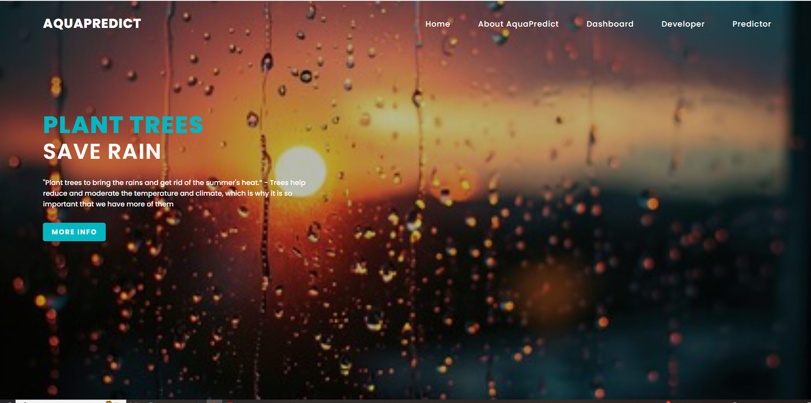

# Rain-Prediction
India is an agricultural country and its economy is largely based upon
crop productivity and rainfall. For analyzing the crop productivity,
rainfall prediction is required and necessary to all farmers. Rainfall
Prediction is the application of science and technology to predict the state
of the atmosphere. It is important to exactly determine the rainfall for
effective use of water resources, crop productivity and pre planning of
water structures. Using different data mining techniques it can predict
rainfall. Data mining techniques are used to estimate the rainfall
numerically. This paper focuses some of the popular data mining
algorithms for rainfall prediction. SVM, Random forest, Decision Tree,
Neural Network and fuzzy logic are some of the algorithms compared in
this paper. From that comparison, it can analyze which method gives
better accuracy for rainfall prediction.

# Tech Stack
* Front-End: HTML, CSS, Bootstrap
* Back-End: Flask
* IDE: Jupyter notebook, Pycharm

# How to run
* First go to the project folder and open the terminal then type the below code
* conda create -n myenv python=3.6
* Activate the environment using the command:
* conda activate myenv
* Then install all the packages by using the following command
* pip install -r requirements.txt
* Now for the final step. Run the app
* python app.py

# Screenshots
* About AquaPredict:
* Dashboard:
* Developer:
* Predictor:
* Result:
  
# Workflow

# Data Collection: 
Any dataset can be used to train this module
We've used the popular kaggle dataset
[Rainfall Prediction in Australia dataset](https://www.kaggle.com/jsphyg/weather-dataset-rattle-package) from Kaggle

# Model Creation:
* Different types of models were tried like catboost, random forest, logistic regression, xgboost, support vector machines, knn, naive bayes.
* Out of these catboost, random forest and support vector machines were top 3
* The conclusion were made using classification metrics. roc curve and auc score
# Model Deployment
* The model is deployed using Flask api

